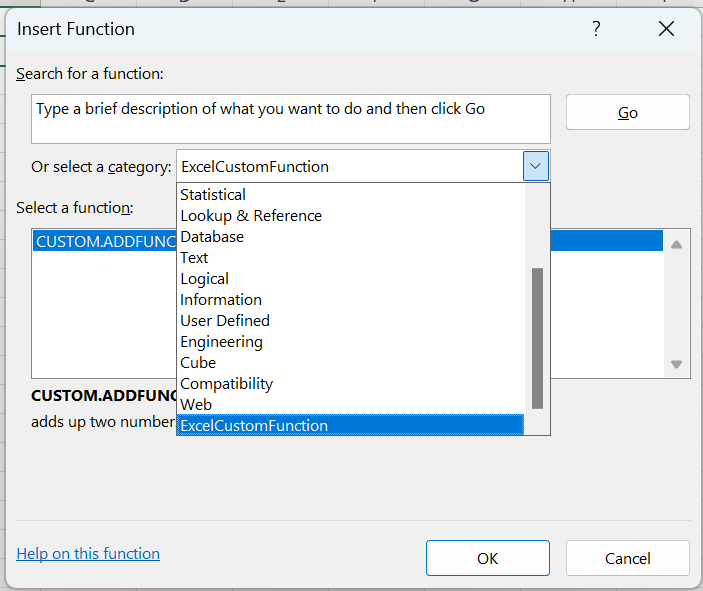
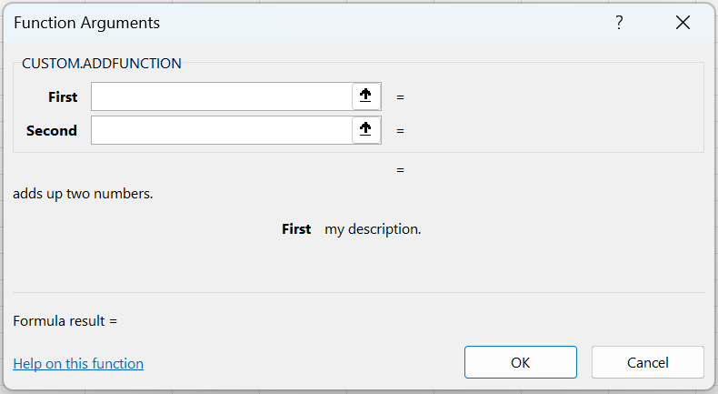

# custom-functions
Excel Office.JS custom function example 

Step by Step Tutorial:
https://bettersolutions.com/javascript/custom-functions/creating-with-notepad.htm

 

<B>Help Link Problem</B>

*) Build the project, upload the files to a https web server and sideload into Excel

*) Select (File > New > Blank workbook)

*) Select (Formulas > Insert Function)

 

*) Select the "CUSTOM.ADDFUNCTION" function

*) Press OK

 

*) Click on the "Help on this function" link

*) The link works correctly

