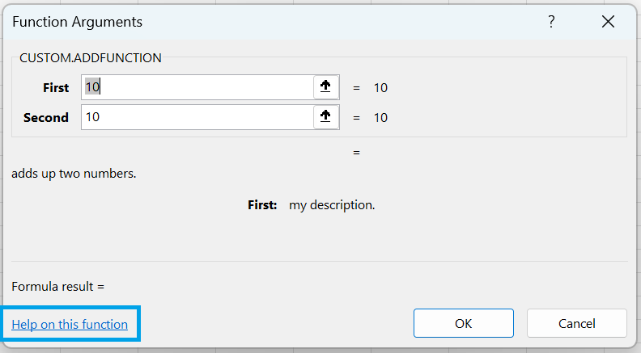

# custom-functions
Excel Office.JS custom function example 

Step by Step Tutorial:
https://bettersolutions.com/javascript/custom-functions/creating-with-notepad.htm

 

<B>Help Link Working</B>

*) Build the project, upload the files to a https web server and sideload into Excel

*) Select (File > New > Blank workbook)

*) Select (Formulas > Insert Function)

 

*) Select the "CUSTOM.ADDFUNCTION" function

*) Press OK

 

*) Click on the "Help on this function" link

*) The link works correctly

<B>Help Link Not Working</B>

*) Enter the arguments 10 and 10 and press OK

 

*) Select cell"B2"

*) Select Insert Function on the Formula Bar

 

*) Click on the "Help on this function" link

*) The link does not work and goes to the following URL:
https://support.microsoft.com/en-us/office/count-function-a59cd7fc-b623-4d93-87a4-d23bf411294c?ns=excel&version=90&syslcid=1033&uilcid=1033&appver=zxl900&helpid=xlmain11.chm60048&ui=en-us&rs=en-us&ad=us
